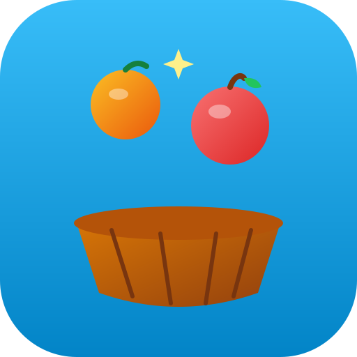

# Fruit Catcher Arcade 🍎🧺

A juicy, fast-paced arcade fruit-catching game built with pure HTML5 Canvas, modern CSS, and JavaScript. Zero external dependencies, fully responsive on mobile and desktop, and ready to deploy to **GitHub Pages**.



---

## 🎮 Game Features

- 🍎 **Variety of Fruits & Drops**:
  - **Apples, Oranges, Bananas, Strawberries, Watermelons, Pineapples**: Give points and coins.
  - ⭐ **Golden Star Fruits**: Rare bonus items worth 100 points that boost the Fever meter!
  - 💣 **Bombs**: Avoid catching bombs! They inflict a -3s time penalty, cause screen shake, and reset your combo (no points lost).
- 🔥 **Hard Mode (Double Bombs & Double Coins)**:
  - Toggle between **Normal** and **Hard Mode** from the title screen or game-over screen.
  - Hard Mode features **2x bomb spawn probability** (up to 26%), a 35% chance for simultaneous **tandem double bombs**, **2X COINS earned**, dedicated high-score tracking, and **no fever bomb protection**!
- ⚡ **Combo System**:
  - Catch fruits consecutively without dropping them to build multipliers up to **5x**!
- 🌟 **Fever Time Mode**:
  - Catching fruits fills your **Fever Meter**.
  - When it reaches 100%, trigger an 8-second **Golden Fruit Rain** with 2x points! (In Normal Mode, fever grants full invulnerability to bombs; in Hard Mode, bombs continue falling and will hit you!).
- 🧲 **Power-Ups**:
  - **Fruit Magnet (🧲)**: Attracts nearby fruits into the basket for 6 seconds.
  - **Time Slow (⏱️)**: Slows down falling speed for easier catches.
  - **Energy Shield (🛡️)**: Blocks 1 bomb explosion damage.
- 🧺 **Basket Skins Shop**:
  - Collect coins during gameplay to unlock custom basket skins:
    - 🧺 **Classic Wicker Basket**
    - 🪙 **Royal Gold Urn**
    - 🤖 **Cyber Mecha Hopper**
    - 🍉 **Melon Bowl**
    - 🐼 **Panda Pouch**
    - 🔥 **Phoenix Flame (Mythical Firebird with Blazing Embers)**
    - 🟢 **Green (The Legendary 10,000 Coins Apex Skin)**
- 🔊 **Procedural Web Audio Engine**:
  - Pitch-shifting catch pops, golden twinkling arpeggios, bomb explosions, and victory fanfares synthesized dynamically in-browser via the Web Audio API (zero audio files downloaded).
- 📱 **Interactive Drag Scroll Bar (Mobile & PC)**:
  - Drag the ergonomic bottom scroll bar across the rail to steer the basket with zero latency. Includes edge nudge arrows (`◀` / `▶`) and skin-matching thumb icons. PWA-ready for offline play.

---

## 🕹️ Controls

| Platform | Controls |
| :--- | :--- |
| **All Platforms (Mobile & PC)** | **Drag the bottom scroll bar** to steer the basket smoothly across the screen • Tap `◀` / `▶` to nudge |
| **Keyboard** | `Left` / `Right` Arrow keys or `A` / `D` to steer • `P` or `Esc` to Pause • `M` to Mute |
| **Mouse / Touch** | Hover or drag horizontally directly on the play area or use the bottom scroll bar |

---

## 🧪 Local Testing

Start a local static web server with Python:

```bash
cd /Users/yoletgong/Documents/github/fruit-catcher
python3 -m http.server 8000
```
Open `http://localhost:8000` in your browser.

---

## 🌐 Deploying to GitHub Pages

1. Create a repository named `fruit-catcher` on GitHub:
   ```bash
   cd /Users/yoletgong/Documents/github/fruit-catcher
   git remote add origin git@github.com:yhngong/fruit-catcher.git
   git push -u origin main
   ```
2. Navigate to **Settings > Pages** in your GitHub repository.
3. Under **Build and deployment > Source**, select **Deploy from a branch**.
4. Select branch `main` and folder `/ (root)`, then click **Save**.
5. Your live game will be accessible at:
   `https://yhngong.github.io/fruit-catcher/`

---

## 📄 License

Open source under the [MIT License](LICENSE).
